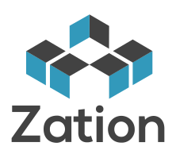

> Application Server Framework

<b>Zation</b> is a node.js application framework. 
You can easily and quickly build secure real-time apps that you can scale.  
It saves you time because zation provides lots of built-in functions.  
The API is easy to use and well structured.

[GitHub](https://github.com/ZationServer)
[Get Started](#zation)